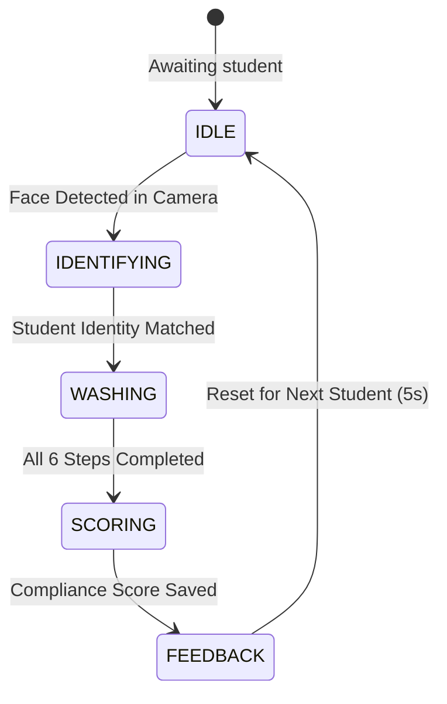

# SMART WASH — Autonomous Kiosk User & Operator Guide

Welcome to **SMART WASH**, the touchless AI-powered kiosk system that uses computer vision to track compliance with the 6 World Health Organization (WHO) handwashing steps.

---

## 🚀 1. Quick Start

### Starting the System
1. **Frontend Kiosk**: Open terminal in project root and run:
   ```bash
   npm run dev
   ```
   - **Student Kiosk**: Open [http://localhost:3000/student](http://localhost:3000/student)
   - **Teacher Portal**: Open [http://localhost:3000/teacher](http://localhost:3000/teacher)

2. **AI Vision Model Server** (FastAPI / PyTorch YOLO):
   ```bash
   py -m uvicorn backend.main:app --port 4550
   ```
   *The kiosk connects automatically via WebSocket at `ws://localhost:4550/ws_model`.*

---

## 📷 2. Camera Setup & Positioning (For Best AI Accuracy)

For the neural network to classify hand gestures accurately, follow these tips:

1. **Camera Angle & Framing**:
   - Keep your upper torso, chest, and hands clearly visible in the camera frame.
   - Maintain a distance of **40–60 cm (about an arm's length)** from the camera.
2. **Hand Washing Zone**:
   - Look at the dashed guide frame on the camera mirror: `[   ] Wash & Rub Hands in View`.
   - **Hold your hands up in front of your chest** inside or just below the frame.
   - Avoid resting your hands on your lap or below the desk where the camera cannot see them.
3. **Lighting & Background**:
   - Ensure your hands and face are well lit from the front.
   - Avoid bright lights or windows directly behind you (backlighting).

---

## 🧼 3. The 6 WHO Handwashing Steps (Technique Guide)

The kiosk tracks 6 recommended handwashing postures. Each step requires **6 seconds of active rubbing** to complete:

| Step | WHO Standard | Technique & Directions | Visual Cue |
| :---: | :--- | :--- | :---: |
| **1** | **Palm to Palm** | Rub palms flat against each other firmly in a steady, circular motion. | 🤲 Rub palms in circles |
| **2** | **Palm over Dorsum** | Place right palm over the back of your left hand with fingers interlaced and rub thoroughly. Then swap hands. | 🖐️ Rub backs of hands |
| **3** | **Fingers Interlaced** | Face palms together with fingers interlaced and rub back and forth in between fingers. | 🤝 Interlace fingers & rub |
| **4** | **Backs of Fingers** | Clasp the backs of fingers against opposing palms with fingers interlocked and rub side-to-side. | ✊ Interlock backs of fingers |
| **5** | **Thumb Rubbing** | Clasp your left thumb inside your closed right palm and rotate back and forth. Then swap thumbs. | 👍 Rotate thumbs in palms |
| **6** | **Fingertips on Palms** | Rub the fingertips of your right hand in small circles against your left palm. Then repeat on the opposite side. | 💅 Rub fingertips in circles |

---

## ⚙️ 4. How the Kiosk Works (Student Journey)



1. **Step Up (Idle ➔ Identifying)**:
   - Stand or sit in front of the kiosk.
   - The Face ID engine scans your face and displays your name with identity confirmation.
2. **Handwashing (Active Vision Tracking)**:
   - Follow the voice assistant and on-screen instructions for Step 1.
   - **Active Rubbing**: When you actively rub your hands, the status indicator glows green:  
     `🟢 Active Hand Movement Detected · Accumulating Time`
   - **Motion Pause**: If you stop moving your hands or lower them, the timer safely pauses:  
     `⚠️ Movement Paused · Hands Still`
   - When 6 seconds of active washing is reached, the step checks off as `✓ Done` and the kiosk transitions to the next step.
3. **Scoring & Feedback**:
   - Once all 6 steps are complete, the scoring engine calculates your compliance score (0–100) based on:
     - Step completion rate (Base: 100 points)
     - Penalty for skipped steps (-15 pts each)
     - Penalty for out-of-order sequence violations (-10 pts each)
   - Your score is saved to the session database, and positive feedback is presented before the kiosk resets.

---

## 🎛️ 5. Demo & Manual Controls

During presentations, testing, or demonstrations:
- **`Skip Step ➔` Button**: Located in the bottom-right corner of the instruction card. Click to instantly advance to the next step.
- **`Complete & Score ➔` Button**: Appears on Step 6. Click to immediately finish and jump to the Scoring/Feedback view.
- **Direct Step Jumping**: **Click directly on any Step Card in the 6-step grid** to immediately jump to that specific step.
- **Manual ID Fallback**: If lighting prevents Face ID from recognizing a student, click *Manual Fallback*, enter the Student ID (e.g. `STU_101`), and click *Proceed with ID*.

---

## 📊 6. Teacher Portal Guide

Teachers access analytics and student management separately at [http://localhost:3000/teacher](http://localhost:3000/teacher):
1. **Overview & Analytics**: View total sessions, class average compliance scores, and weekly trends.
2. **Student Compliance Roster**: Live table of all students, their total sessions, and average scores.
3. **Enroll New Student**:
   - Enter student name, ID, and grade.
   - Capture a face photo or click *Capture from Webcam* to compute the 128-dimensional biometric descriptor.
   - The student is immediately recognizable by the kiosk.
4. **Leaderboard**: Displays top students ranked by streak count and compliance score.

---

## 🛠️ 7. Troubleshooting

| Issue | Cause | Solution |
| :--- | :--- | :--- |
| **HUD shows `AI Backend: RECONNECTING`** | Backend server is not running. | Run `py -m uvicorn backend.main:app --port 4550` in your terminal. |
| **Timer stays paused / Hands not detected** | Hands are held too low or not moving. | Raise hands in front of your chest within the dashed guide box and rub firmly. |
| **Face ID shows "Student Not Recognized"** | Student is not yet enrolled in database. | Use the *Manual Fallback* box or enroll the student in `/teacher`. |
| **Camera video is black** | Camera permissions blocked by browser. | Click the camera icon in your browser address bar and choose *Always allow*. |
