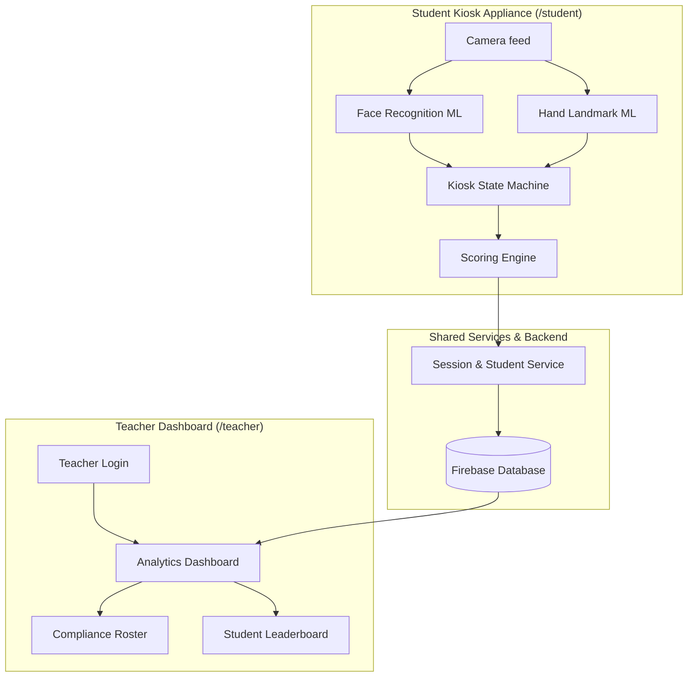
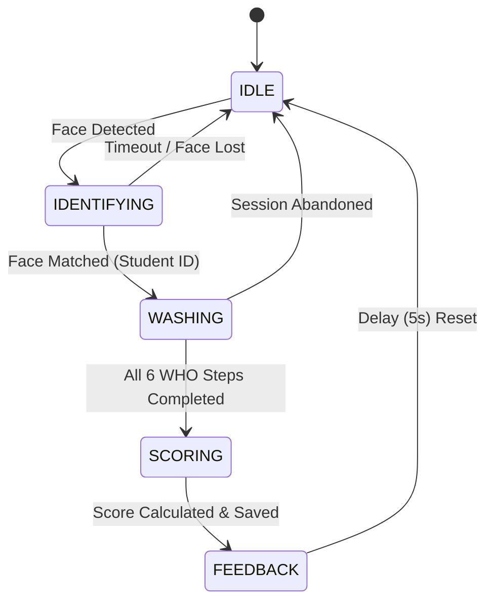

# Smart Wash System Workflow & Architecture

This document outlines the end-to-end workflow, system architecture, and user journeys for the Smart Wash Autonomous AI Handwashing Kiosk System.

## 1. High-Level Architecture

The system is separated into two primary applications connected by a shared backend:

## 2. Student Journey & Kiosk State Machine

The kiosk operates autonomously without requiring manual input (keyboard/mouse). It transitions between states automatically based on AI vision events.

### State Breakdown:
1. **IDLE**: The default state. Awaiting a student to step up to the sink.
2. **IDENTIFYING**: A face is detected. The `face-api.js` model runs to match the 128-d face descriptor against the database.
3. **WASHING**: The handwashing begins. The TensorFlow.js LSTM model tracks the student's hand landmarks to ensure they are completing the 6 WHO-recommended handwashing steps.
4. **SCORING**: Washing is complete. The system calculates a score (0-100) based on step completion, step duration, and ML confidence. The session is saved to the backend.
5. **FEEDBACK**: The final score and feedback are displayed to the student before resetting for the next person.

## 3. Data Flow

Data is heavily standardized using a shared contract (`shared/types.js`) to ensure all components can communicate cleanly.

### Session Lifecycle
1. **Creation**: When a student is identified, a new `Session` document is created in the database with the `studentId`, `studentName`, and a start timestamp.
2. **Updates**: As the student washes, local state tracks their progress.
3. **Completion**: Once finished, the session is updated in the database with the final `score`, the completed `steps` array (containing durations and confidences), and a status of `completed`.

## 4. Teacher Journey

Teachers do not interact with the kiosk directly. They use a separate portal.

1. **Login**: Teacher navigates to `/teacher` and logs in.
2. **Overview**: The dashboard fetches all students and recent sessions from the database.
3. **Analytics**: The dashboard computes class averages, active students, and compliance rates.
4. **Review**: The teacher can view the compliance roster and a leaderboard to identify which students might need further handwashing instruction.
